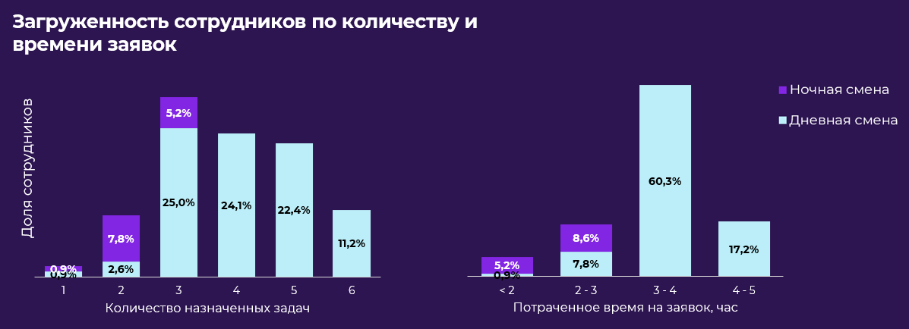

# Инструкция

## Запуск веб сайта


Для запуска веб-сайта необходимо клонировать репозиторию и выполнить команду
```sh
docker-compose -f "docker-compose.local.yml" up --build
```
Программа автоматически создаст необходимые данные в PostgreSQL. Также добавит тестовые данные в базу данных из <b>metro_assist/base_data</b>.<br>
Сайт будет доступен по адресу http://localhost:8000 <br><br>
Если захочется подключиться к базе данных через клиент, то данные для подключения можно взять из <b>env/.env.local</b>. Единственное, порт 5432 перенаправляется на 6543 (то есть нужно будет указать 6543).<br>

При желании можно запустить проект на удаленной машине. Тогда нужно будет просто создать <b>env/.env.prod</b> и указать свои данные.
На данный момент сайт работает по адресу http://62.217.177.92:8000.


### Информация по скорости и по кол-ву выполненных задач
 - Железо: <b>intel core i7-11800H</b>
 - Скорость назначения задач: <b>19.56 сек</b>
 - Количество назначенных задач: <b>458</b> из <b>617</b> (по каждой задаче могут быть более одного назначения)
 
### Наши преимущества
 - Привели задачу распределения к форме VRPTW и решили с помощью инструмента от Google, OR-Tool
 - Алгоритм максимизирует количество назначений, при этом равномерно распределяя заявки между сотрудниками по времени работы
 - Измененные или новые заявки/сотрудники будут учитываться при распределении
 - При назначении учитываются пол, количество сотрудников на заявку, статус заявки и требование ждать пассажира за 15 минут до начала заявки
 - Назначает обеды для всех сотрудников, соблюдая требования из технического задания (не ранее чем через 3,5 часа после начала работы и закончится не позже чем за 1 час до конца рабочего дня)
 - Полный доступ и управление базой данных через административную панель
 - Возможность скачать назначения в табличном формате (Excel)
 - Возможность скачать статистику назначений в табличном формате (Excel)
#### Дополнительные преимущества
 - Эффективное использование многопоточности для параллельного вычисления маршрутов и оптимизации времени выполнения алгоритма
 - При создании заявки автоматический расчет времени выполнения (с возможностью указать свое), построение маршрута от одной станции до другой с указанием пересадок, если они есть
 - При создании заявки автоматическое заполнение категории заявки на основе выбранного пассажира
 - Удобный поиск пассажиров и станций метро


### Административная панель
Подключена административная панель, которая позволяет гибко и комфортно управлять всей базой.
Административная панель позволяет:
 - Добавить/Удалить/Изменить сотрудников, пассажиров, заяавки, рассписание и т.д. (также можно добавить новые статусы, категории, должности, ...)
 - Доступна фильтрация, поиск, сортировка по различным полям.
 
При запуске сайта автоматический создатеся администратор
 - username - admin 
 - password - admin
Также можно создать новых администраторов или пользовательей системы


### Алгоритм распределения задач

Для решения задачи назначения сотрудников метро на заявки пассажиров мы использовали известный подход к решению задачи маршрутизации транспортных средств с временными окнами (VRPTW). Основная цель этого подхода — минимизация общего времени в пути транспортных средств.

Многие задачи маршрутизации транспортных средств связаны с планированием посещений клиентов, доступных только в определенные временные интервалы. Эти задачи известны как VRPTW.

Мы адаптировали нашу задачу к VRPTW. В нашем случае транспортными средствами выступают сотрудники метро, а клиентами — пассажиры. Временные окна определяются как интервал от времени начала заявки минус 15 минут до времени начала заявки.

Для каждого посещения учитывается маршрут от начальной станции до конечной, а также от конечной станции первой задачи до начальной станции второй задачи. Таким образом, мы привели задачу к формату VRPTW и решили ее аналогичным образом.

Цель оптимизации в нашем случае — максимизация количества выполненных заявок при равномерном распределении времени выполнения заявок между сотрудниками.
